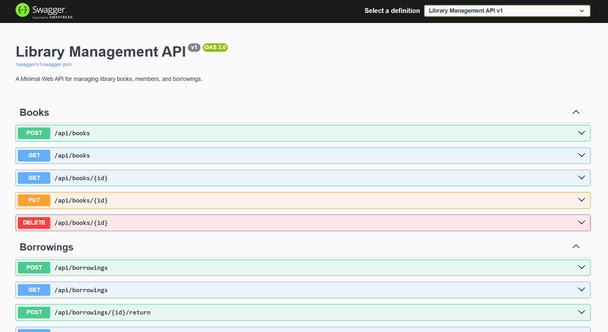

# Library Management API

A backend API for a small library to manage books, members, and the borrowing/returning workflow. Built as a Minimal API on .NET 10, with EF Core + PostgreSQL, a repository/service layering, and behavior-rich domain entities (e.g. `Book.BorrowCopy()`, `Borrowing.ReturnBook()`).

## Table of Contents

- [Overview](#overview)
- [Technologies Used](#technologies-used)
- [Project Structure](#project-structure)
- [Getting Started](#getting-started)
- [Seed Data](#seed-data)
- [Available Endpoints](#available-endpoints)
- [Example API Requests](#example-api-requests)
- [Business Rules Reference](#business-rules-reference)
- [Error Response Format](#error-response-format)
- [Testing](#testing)
- [Assumptions](#assumptions)

## Overview

The API supports three core resources:

- **Books** — create, read, update, delete, with copy tracking (`TotalCopies` / `AvailableCopies`).
- **Members** — register and manage library members, with an active/inactive flag.
- **Borrowings** — borrow and return books, with a 3-active-borrow limit per member, a 14-day due date, and per-member borrowing history.

Business rules live in the application service layer (`BookService`, `MemberService`, `BorrowingService`) and in the domain entities themselves, not in the endpoint handlers. Endpoints stay thin: parse the request, call a service, shape the HTTP response.

## Technologies Used

| Concern | Choice |
|---|---|
| Runtime | .NET 10, ASP.NET Core Minimal APIs |
| ORM | Entity Framework Core (Npgsql provider) |
| Database | PostgreSQL 16 (via Docker) |
| Validation | `System.ComponentModel.DataAnnotations` + a custom `ValidationFilter<T>` endpoint filter |
| API Docs | Swashbuckle (Swagger / OpenAPI) |
| Testing | xUnit + Moq (see [Testing](#testing)) |
| Data access pattern | Repository per aggregate + application service layer |
| IDs | `Guid`, generated in the entity constructors |

## Project Structure

```
Library.Api/
  Endpoints/            Minimal API endpoint definitions + ValidationFilter<T>
  Contracts/             Request/response DTOs, grouped by resource
    Books/
    Members/
    Borrowings/
    Common/               ErrorResponse, ValidationErrorResponse
  Domain/
    Entities/             Book, Member, Borrowing — behavior-rich domain models
    Enums/                BorrowingStatus
    Exceptions/           NotFoundException, ConflictException, BusinessRuleException
  Application/
    Services/             BookService, MemberService, BorrowingService
    Interfaces/            Repository and service abstractions
  Infrastructure/
    Data/                 LibraryDbContext, DataSeeder
    Repositories/          Repository implementations
  Middleware/              ExceptionHandlingMiddleware (maps domain exceptions -> HTTP status codes)
  Migrations/               EF Core migrations
  Program.cs

Library.Api.Tests/        xUnit test project
docker-compose.yml          PostgreSQL container definition
API-TESTING.md               Manual curl-based test script for every endpoint
```

## Getting Started

### Prerequisites

- .NET 10 SDK
- Docker Desktop

### 1. Run PostgreSQL with Docker

From the repository root:

```bash
docker-compose up -d
```

This starts a `library-postgres` container using the settings in `docker-compose.yml`:

| Setting | Value |
|---|---|
| Host | `localhost` |
| Port | `5432` |
| Database | `librarydb` |
| Username | `libraryuser` |
| Password | `librarypassword` |

Verify it's running with `docker ps`.

### 2. Run the API

Migrations are applied automatically at startup (`context.Database.MigrateAsync()` in `Program.cs`), and seed data is inserted right after — no manual `dotnet ef` step is required for a normal run.

From Visual Studio, pick the **http** (or **https**) launch profile in the toolbar dropdown and press F5 / Ctrl+F5. From the CLI:

```bash
dotnet run --project Library.Api
```

The `http` profile (`Library.Api/Properties/launchSettings.json`) binds the API to `http://localhost:5120`. Running the raw executable instead of going through a launch profile falls back to Kestrel's default port `5000` and the `Production` environment — use the launch profile to get the expected port and auto-opened Swagger tab.

### 3. Access Swagger

Once running:

```
http://localhost:5120/swagger
```

Swagger UI lists all endpoints grouped by tag (Books, Members, Borrowings) with request/response schemas and status codes.



## Seed Data

`Infrastructure/Data/DataSeeder.cs` seeds sample data once, only if both the `Books` and `Members` tables are empty:

- **5 books**: Clean Code (3 copies), The Pragmatic Programmer (2), Domain-Driven Design (2), Refactoring (1), Design Patterns (4)
- **3 members**: Alice Johnson, Bob Smith, Carol White (Carol has no phone number)
- **2 active borrowings**: Alice has Clean Code borrowed, Bob has Refactoring borrowed — so `GET /api/borrowings` and the member-history endpoint return data immediately

Since seeded IDs are GUIDs generated at runtime, pull real IDs from `GET /api/books` / `GET /api/members` before testing borrow/return. To reset, drop the database (`dotnet ef database drop`) and re-run the app — it will re-migrate and reseed on startup.

## Available Endpoints

### Books

| Method | Endpoint |
|---|---|
| POST | `/api/books` |
| GET | `/api/books` |
| GET | `/api/books/{id}` |
| PUT | `/api/books/{id}` |
| DELETE | `/api/books/{id}` |

### Members

| Method | Endpoint |
|---|---|
| POST | `/api/members` |
| GET | `/api/members` |
| GET | `/api/members/{id}` |
| PUT | `/api/members/{id}` |
| DELETE | `/api/members/{id}` |

### Borrowings

| Method | Endpoint |
|---|---|
| POST | `/api/borrowings` |
| GET | `/api/borrowings` |
| POST | `/api/borrowings/{id}/return` |
| GET | `/api/members/{memberId}/borrowings` |

## Example API Requests

Create a book:

```bash
curl -X POST http://localhost:5120/api/books \
  -H "Content-Type: application/json" \
  -d '{"title":"The Hobbit","author":"J.R.R. Tolkien","isbn":"9780618260300","publishedYear":1937,"totalCopies":2}'
```

Register a member:

```bash
curl -X POST http://localhost:5120/api/members \
  -H "Content-Type: application/json" \
  -d '{"fullName":"Dana Lee","email":"dana.lee@example.com","phoneNumber":"0712345678"}'
```

Borrow a book:

```bash
curl -X POST http://localhost:5120/api/borrowings \
  -H "Content-Type: application/json" \
  -d '{"bookId":"<book-id>","memberId":"<member-id>"}'
```

Return a book:

```bash
curl -X POST http://localhost:5120/api/borrowings/<borrowing-id>/return
```

View a member's borrowing history:

```bash
curl http://localhost:5120/api/members/<member-id>/borrowings
```

A larger set of runnable requests, including validation/error cases and a full end-to-end flow, is in [API-TESTING.md](API-TESTING.md).

## Business Rules Reference

| Rule | Enforced In |
|---|---|
| Title, Author, Isbn, PublishedYear, TotalCopies are required | `CreateBookRequest` / `UpdateBookRequest` data annotations |
| `TotalCopies` must be greater than 0 | `[Range]` on the request DTO |
| `PublishedYear` cannot be in the future | `BookService.CreateAsync` / `UpdateAsync` (compared against `DateTime.UtcNow.Year`) |
| Isbn is unique | `BookService` (checked via `IBookRepository.GetByIsbnAsync`) → `409 Conflict` |
| `TotalCopies` cannot drop below currently-borrowed copies | `Book.Update()` |
| Email is unique | `MemberService` (checked via `IMemberRepository.GetByEmailAsync`) → `409 Conflict` |
| New members are active by default | `Member` constructor |
| Inactive member cannot borrow | `BorrowingService.BorrowAsync` |
| Book can be borrowed only if `AvailableCopies > 0` | `BorrowingService.BorrowAsync` + `Book.BorrowCopy()` |
| Member cannot exceed 3 active borrowings | `BorrowingService.BorrowAsync` (`MaxActiveBorrowings = 3`) |
| Borrowing reduces `AvailableCopies` by 1 | `Book.BorrowCopy()` |
| Returning increases `AvailableCopies` by 1 | `Book.ReturnCopy()` |
| A borrowing cannot be returned twice | `BorrowingService.ReturnAsync` + `Borrowing.ReturnBook()` |
| Due date is 14 days from the borrow date | `Borrowing` constructor |

## Error Response Format

All unhandled domain exceptions are mapped to a consistent JSON shape by `ExceptionHandlingMiddleware`:

```json
{
  "statusCode": 404,
  "message": "Book not found.",
  "traceId": "0HN..."
}
```

Request validation failures (from `ValidationFilter<T>`) include a per-field breakdown instead:

```json
{
  "statusCode": 400,
  "message": "Validation failed",
  "errors": [
    { "field": "Email", "message": "The Email field is required." }
  ]
}
```

| Scenario | Status Code |
|---|---|
| Created | 201 |
| Read / updated | 200 |
| Deleted | 204 |
| Validation failure | 400 |
| Business rule violation (`BusinessRuleException`) | 400 |
| Not found (`NotFoundException`) | 404 |
| Duplicate ISBN or email (`ConflictException`) | 409 |
| Unhandled exception | 500 |

## Testing

`Library.Api.Tests` is an xUnit project (with Moq for mocking repositories and `coverlet.collector` for coverage) that exercises `BookService`, `MemberService`, and `BorrowingService` directly, without a database. Run it with:

```bash
dotnet test
```

Current coverage (`Library.Api.Tests/Services/`):

| Test | Rule under test |
|---|---|
| `BookServiceTests.CreateAsync_WithDuplicateIsbn_ThrowsConflictException` | ISBN uniqueness |
| `MemberServiceTests.CreateAsync_WithDuplicateEmail_ThrowsConflictException` | Email uniqueness |
| `BorrowingServiceTests.BorrowAsync_WhenNoAvailableCopies_ThrowsBusinessRuleException` | Book can be borrowed only if `AvailableCopies > 0` |
| `BorrowingServiceTests.BorrowAsync_WhenMemberIsInactive_ThrowsBusinessRuleException` | Inactive member cannot borrow |
| `BorrowingServiceTests.BorrowAsync_WhenMemberHasThreeActiveBorrowings_ThrowsBusinessRuleException` | Member cannot exceed 3 active borrowings |
| `BorrowingServiceTests.ReturnAsync_WhenAlreadyReturned_ThrowsBusinessRuleException` | A borrowing cannot be returned twice |

## Assumptions

- `PublishedYear` is validated against the current UTC year; a year equal to the current year is allowed, anything later is rejected.
- `BorrowingStatus` defines an `Overdue` value, but nothing currently transitions a borrowing from `Borrowed` to `Overdue` automatically — that would need a background job or a computed check against `DueDate`, which is out of scope here.
- The connection string and PostgreSQL credentials are checked into `appsettings.json` for convenience since this is a local/assessment setup, not a production deployment.
- Entity IDs are server-generated GUIDs rather than sequential integers, so client requests never supply an `id` on create.
- A `Borrowing` record is never deleted after a return — `ReturnAsync` only transitions its `Status` to `Returned` and sets `ReturnedDate`, so full borrowing history is preserved for `GET /api/members/{id}/borrowings`.
